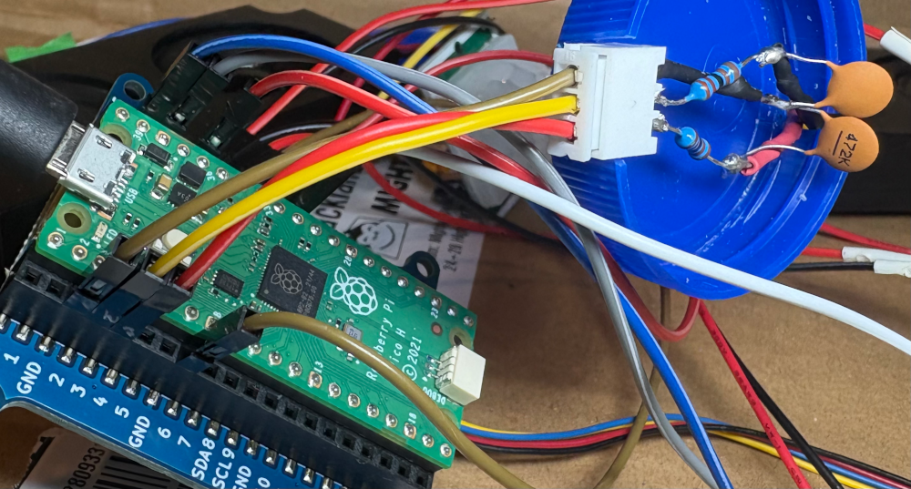
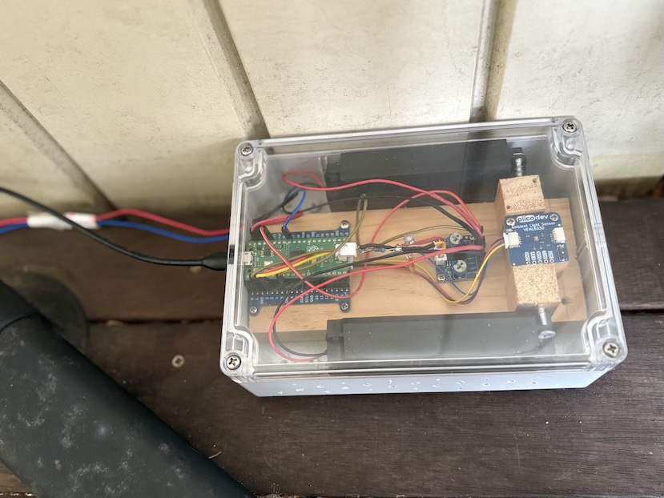

# Pico Dog - A Motion-Activated Audio Alarm System

By andruhon | Updated February 2025

## An instant response security system that actually works!

If you've got security cameras tied to cloud services, you'll know the frustration – push notifications arrive with latency, footage takes ages to load, and by the time you realise someone's at your door, they're already gone. I needed something that reacts instantly to motion at my porch, warns potential intruders that they're being monitored, and gives me immediate awareness when someone's about.

Enter the Pico Dog – a simple yet effective motion-activated alarm system that detects movement with a PIR sensor and plays a dog bark sound when it's dark outside. Unlike cloud-based systems, this responds immediately. It's already repelled a few people poking around my porch at night, and it works brilliantly alongside my security cameras.

As a bonus, I've created a Halloween edition that plays spooky sounds for trick-or-treaters – with the ambient light detection disabled, it entertains kids coming to grab some lollies.

Download all the code and circuit files at my GitHub here: https://github.com/andruhon/pico-dog

**Special Halloween Edition:** https://github.com/andruhon/pico-dog/tree/halloween-edition


## How It Works

The system is beautifully simple. The Raspberry Pi Pico monitors a PIR (Passive Infrared) motion sensor continuously. When motion is detected, it checks the ambient light level using a VEML6030 light sensor. If it's dark enough, it triggers an audio file through a PAM8406 amplifier connected to dual speakers, playing a convincing dog bark sound.

The PIR sensor detects infrared radiation changes – essentially, it picks up the heat signature of moving objects. The HC-SR501 module has two potentiometers: one controls sensitivity, and the other sets the timeout delay. I've found that turning both counterclockwise quite a bit prevents false positives from things like wind-blown branches or small animals.

The light sensor ensures the system only activates at night. There's no point barking at the postie during the day, but anyone lurking around your porch after dark will get an immediate audio warning.

## Bill of Materials

- 1x Raspberry Pi Pico
- 1x PIR Infrared Motion Sensor (HC-SR501)
- 1x PiicoDev LiPo Expansion Board for Raspberry Pi Pico
- 1x Adjustable Dual Channel Audio Amplifier 2.5-5.5V (PAM8406) - [Available from Core Electronics](https://core-electronics.com.au/adjustable-dual-channel-audio-amplifier.html)
- 2x Enclosed Speaker - 8 Ohm, 5 Watt
- 1x PiicoDev Ambient Light Sensor VEML6030
- 2x 2K2Ω resistors (for audio filter)
- 2x 4.7nF capacitors (for audio filter)
- Assorted wires

## The Circuit

The circuit is straightforward, though there are a few tricks worth knowing.


### Amplifier and Speakers

The PAM8406 amplifier has VCC, GND, ROUT+, ROUT-, LOUT+, LOUT- on one side and RIN, GND, LIN on the other.

- LIN and RIN of the amplifier connect to GP2 and GP3 on the Pico (through a filter – see below!)
- VCC of the amplifier connects to 3V3(OUT) on the Pico
- ROUT+ connects to the red wire on the right speaker, ROUT- to black
- LOUT+ connects to the red wire on the left speaker, LOUT- to black
- GND from the amplifier connects to GND on the Pico

### PIR Sensor

The pin labels are likely hidden under the plastic lens, so you might need to peek underneath.

**Important:** Don't forget to tune both potentiometers counterclockwise quite a bit, otherwise you'll get false positives continuously.

- VCC of the sensor connects to VSYS (5V) on the Pico
- OUT of the sensor connects to GP27 on the Pico
- GND of the sensor connects to GND on the Pico

There's information floating around about running the sensor from 3.3V by connecting to the H pin, but this is probably unnecessary with the Pico. Mine works fine from VSYS.

### Ambient Light Sensor

The VEML6030 light sensor is connected via the PiicoDev LiPo Expansion Board, which makes wiring a breeze.

### The Audio Filter – Solving the Howling Problem

Here's where things get interesting. The PicoAudioPWM library uses PWM (Pulse Width Modulation) to produce sound, with a base frequency of 122KHz. This high-frequency carrier signal drives the PAM8406 amplifier absolutely mental, creating horrible howling and whistling sounds.

The solution is a simple low-pass filter between the Pico and the amplifier. I assembled a filter with a 15KHz cutoff using 4.7nF capacitors (C1, C2) and 2K2Ω resistors (R1, R2). It drains the higher frequencies to ground and works brilliantly. You can calculate different component values using the formula: `C = 1/(2πRf)` where f is your desired cutoff frequency.




## Enclosure

The enclosure is a generic waterproof project box from a local DIY store. The most important consideration is that the lid is translucent, allowing the ambient light sensor to function properly without needing to be exposed to the elements.

For the speakers, the casing needs some perforation to let sound through clearly. I simply drilled a number of holes with a hand drill on both sides of the enclosure – nothing fancy, but it works well.



### PIR Sensor Housing

The PIR sensor housing is a creative solution using two paint sampler jars. These are connected to the ceiling in such a way that they form a pan-tilt mechanism, allowing the PIR sensor to be pointed in almost any direction. This flexibility is crucial for getting the detection angle just right for your specific installation.


## The Software

The software runs on MicroPython and uses several excellent libraries:

- **PicoAudioPWM** for playing WAV files through PWM
- **PiicoDev libraries** for the VEML6030 light sensor
- **Standard MicroPython** for PIR sensor monitoring

The main loop is simple: monitor the PIR sensor, check light levels, and trigger audio when both conditions are met. The system responds instantly – no cloud delays, no buffering, just immediate reaction.

### Installation

**Prerequisites:** MicroPython must be installed on your Raspberry Pi Pico. Installation instructions at https://micropython.org/download/RPI_PICO/

**Note:** Connecting to the Pico on Linux can sometimes be tricky – check the linux.md file in the repo for troubleshooting tips.

Install dependencies to your Pico:

```bash
mpremote mip install github:joeky888/awesome-micropython-lib/Audio/chunk.py
mpremote mip install github:joeky888/awesome-micropython-lib/Audio/wave.py
mpremote mip install github:danjperron/PicoAudioPWM/myDMA.py
mpremote mip install github:danjperron/PicoAudioPWM/myPWM.py
mpremote mip install github:danjperron/PicoAudioPWM/wavePlayer.py
mpremote mip install github:CoreElectronics/CE-PiicoDev-Unified/PiicoDev_Unified.py
mpremote mip install github:CoreElectronics/CE-PiicoDev-VEML6030-MicroPython-Module/PiicoDev_VEML6030.py
```

Copy the source code to your Pico:

```bash
mpremote fs cp -r src/* :
```

Verify installation:
- Run `mpremote ls` to confirm everything copied correctly (you may need to restart the Pico)
- Run `mpremote df` to check available space

### Custom Sounds

Want to use your own sounds? Make sure they're **16-bit WAV files with a 16000 Hz sample rate**. I use [Kwave](https://apps.kde.org/kwave/) (open source audio editor) for converting files.

The default dog bark sound comes from [abhisheky948 on Freesound](https://freesound.org/people/abhisheky948/sounds/625498/), and it's convincingly realistic.

**Recovery Tip:** If you accidentally copy a corrupted file and your Pico seems bricked, you can flash it with the official Raspberry Pi memory reset: [flash_nuke.uf2](https://www.raspberrypi.com/documentation/microcontrollers/pico-series.html#resetting-flash-memory)

## Real-World Performance

I've had this running for several months now, and it's exceeded expectations. The instant response is the killer feature – when someone approaches my porch at night, they hear the bark immediately, and it's clearly effective at deterring unwanted visitors. A couple of times I've caught people on my security cameras who clearly got startled by the bark and promptly left.

The light sensor works well for distinguishing day from night, though you might want to tune the threshold depending on your location and whether you have street lights nearby. The PIR sensor, once properly calibrated, has been reliable with minimal false positives.

Power-wise, the system runs continuously without issues. If you want to make it portable, the PiicoDev LiPo Expansion Board supports battery power, though I've kept mine plugged in.

## The Halloween Edition

The Halloween version disables the ambient light detection and plays spooky sounds instead of dog barks. It's been a hit with trick-or-treaters – kids approach the porch, trigger the sensor, and get greeted with ghostly moans or creepy laughs. Much more entertaining than a bowl of lollies sitting there silently!

## Download Files

All code, circuit diagrams, and documentation are available on GitHub:
- **Main project:** https://github.com/andruhon/pico-dog
- **Halloween edition:** https://github.com/andruhon/pico-dog/tree/halloween-edition

## Additional Resources

- [PIR Sensor Tutorial](https://lastminuteengineers.com/pir-sensor-arduino-tutorial/) - Excellent explanation of how PIR sensors work (Arduino-based but the principles apply)
- [PiicoDev VEML6030 Guide](https://core-electronics.com.au/guides/piicodev-ambient-light-sensor-veml6030-quickstart-guide-for-rpi-pico/) - Light sensor quickstart guide from Core Electronics

## Final Thoughts

This project proves that sometimes the simplest solutions are the most effective. No cloud services, no subscription fees, no complicated setup – just a Pico, some sensors, and immediate response when it matters. Whether you're looking to enhance your home security or just want to have some fun with motion-activated sounds, the Pico Dog delivers.

Give it a go, and feel free to reach out if you've got questions or improvements!