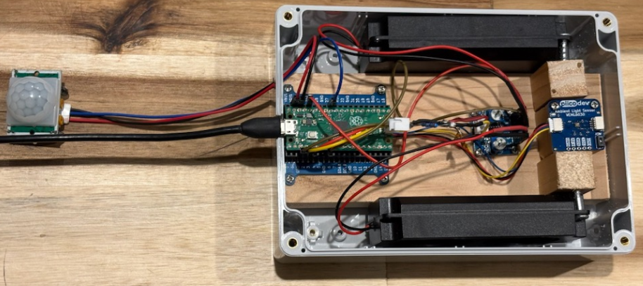
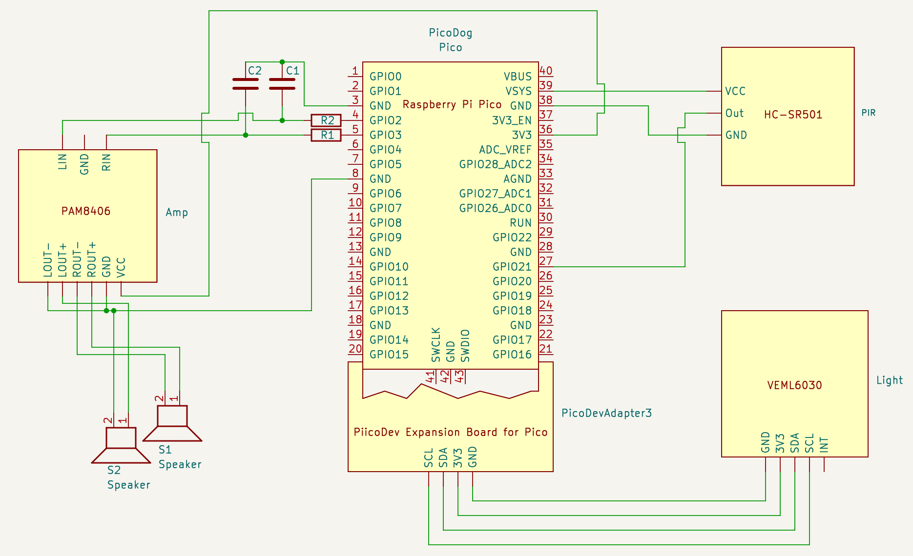

# Pico Dog

Detects motion and plays a dog bark sound when it's dark.

**Special Halloween Edition:** https://github.com/andruhon/pico-dog/tree/halloween-edition

See [materials.md](materials.md) for the list of materials used.  
See [circuit.md](circuit.md) for circuit details.




## Audio Sources

Dog bark sound:  
[Dog Bark by abhisheky948](https://freesound.org/people/abhisheky948/sounds/625498/)

## Installation

### Development Environment (Optional)

If you need to work with the project files locally, you can create a Python virtual environment:

```
python -m venv venv
source venv/bin/activate
python -m pip install -r requirements.txt
```

### Dependencies

This package uses the following packages as dependencies:
* https://github.com/joeky888/awesome-micropython-lib.git
* https://github.com/danjperron/PicoAudioPWM.git
* https://github.com/CoreElectronics/CE-PiicoDev-Unified/blob/main/PiicoDev_Unified.py
* https://github.com/CoreElectronics/CE-PiicoDev-VEML6030-MicroPython-Module/blob/main/PiicoDev_VEML6030.py

### Deploying to Pico

**Prerequisites:** MicroPython must already be installed on your Raspberry Pi Pico. Installation instructions can be found at https://micropython.org/download/RPI_PICO/

**Note:** Connecting to Raspberry Pi Pico on Linux may sometimes be challenging. Check [linux.md](linux.md) for troubleshooting tips.

**mpremote documentation:** https://docs.micropython.org/en/latest/reference/mpremote.html

Install dependencies to Pico:

```bash
mpremote mip install github:joeky888/awesome-micropython-lib/Audio/chunk.py
mpremote mip install github:joeky888/awesome-micropython-lib/Audio/wave.py
mpremote mip install github:danjperron/PicoAudioPWM/myDMA.py
mpremote mip install github:danjperron/PicoAudioPWM/myPWM.py
mpremote mip install github:danjperron/PicoAudioPWM/wavePlayer.py
mpremote mip install github:CoreElectronics/CE-PiicoDev-Unified/PiicoDev_Unified.py
mpremote mip install github:CoreElectronics/CE-PiicoDev-VEML6030-MicroPython-Module/PiicoDev_VEML6030.py
```

Copy sources to Pico:

```bash
mpremote fs cp -r src/* :
```

Verify installation:
- Run `mpremote ls` to make sure everything is copied over (you may need to restart the Pico to pick up changes)
- Run `mpremote df` to check available space on the Pico

## Custom Sounds

When using your own sounds, make sure they are **16-bit WAV files with a 16000 Hz sample rate**. You can use [Kwave](https://apps.kde.org/kwave/) (open source audio editor) to convert files.

**Recovery:** If you copied a corrupted file and your Pico seems to be bricked, you can flash it with the official Raspberry Pi memory reset: [flash_nuke.uf2](https://www.raspberrypi.com/documentation/microcontrollers/pico-series.html#resetting-flash-memory)

## Links

* [PIR Sensor Tutorial](https://lastminuteengineers.com/pir-sensor-arduino-tutorial/) - Explains how PIR sensors work (Arduino-based but applicable)
* [PiicoDev VEML6030 Guide](https://core-electronics.com.au/guides/piicodev-ambient-light-sensor-veml6030-quickstart-guide-for-rpi-pico/) - Light sensor quickstart guide