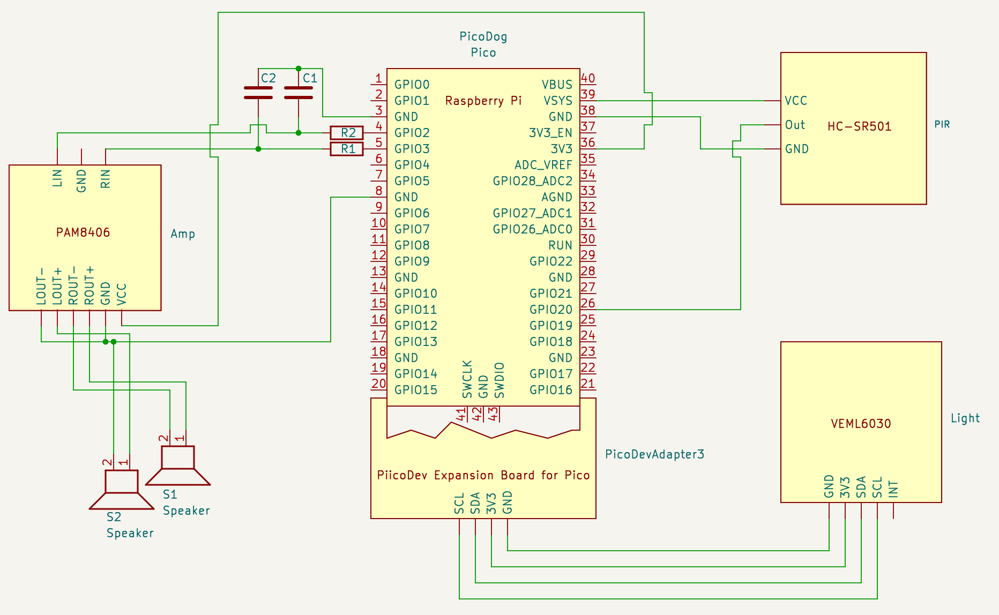
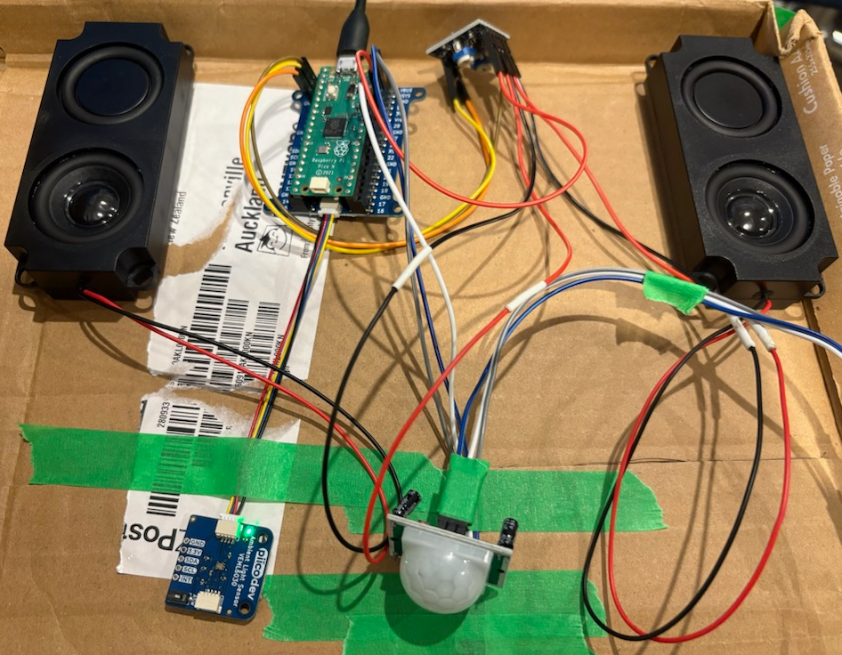

# Circuit 

I have two enclosed speakers, each of them has black and red wires.

Amplifier has VCC, GND, ROUT+, ROUT-, LOUT+, LOUT- on one side 
and RIN, GND, LIN on another side.

Raspberry Pico appears to be ordinary pico.

* Amplifier and Speakers
    * LIN and RIN of Amplifier are connected to GP2 and GP3 on Pico (likely to need filter, see below)
    * VCC of Amplifier is connected to 3V3(OUT) on Pico.
    * Amplifier is connected speakers via ROUT and LOUT. ROUT+ connects to redwire on right speaker, ROUT- connects to black wire on right speaker. Left speaker connected similarly.
    * GND from out side on Amplifier is connected to GND on Pico.
* PIR Sensor (Pin labels are likely to be under plastic lens) **Don't forget to tune both potentiometers counterclockwise quite a bit, otherwise it is likely to give false positives continuously.**
    * VCC of Sensor is connected to VSYS (5V) on Pico
    * OUT of Sensor is connected to GP26 on Pico
    * GND of Sensor is connected to GND on Pico
* Ambient Light Sensor
    * Connected via PiicoDev LiPo Expansion Board

# Amplifier high frequency howling
The PicoAudioPWM uses PWM (Pulse width modulation) to produce sound. This means that the sound has some bearing frequency (122KHz in our case) and this base signal makes amplifier crazy making horrible howling and whistling sound. The easiest way to get rid of this howling is to add a filter between pico and amplifier.
I ended up assembling a filter for 15KHz cutoff with 4.7nF capacitors (C1, C2) and 2K2Ω resistors (R1, R2). It seems to work really well so far. The filter drains higher frecuences to the ground. `C = 1/(2*π*R*f)` this formula can be used to determine components for desired frequency cut off.

# PIR Sensor
There's a bit of information about how to run the sensor from 3.3 volts, and it will probably do with connecting 3V3OUT to H pin on the sensor.

This is probably unnecessary with Pico. Seems to be working fine from 
VSYS. What was necessary is to tune both potentiometers counterclockwise quite a bit, otherwise it was giving false positives non-stop.
See [test-pir-sensor.py](test-pir-sensor.py) for standalone sensor example.

